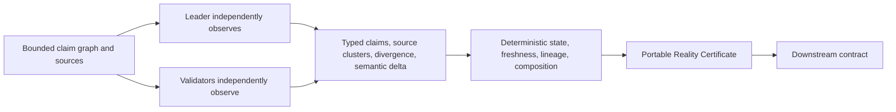

# Reality Checkpoint Protocol

**Consensus-backed checkpoints for external reality, with semantic drift, source disagreement, composition, freshness, and portable state certificates.**

Reality Checkpoint Protocol is a reusable GenLayer primitive. A creator fixes a bounded claim graph, sources, retrieval modes, source-independence floor, and freshness policy. Validators independently observe the sources and classify claim meaning and source relationships. Deterministic contract code decides whether the result is admissible, how it affects lineage, whether it is fresh, how composites resolve, and whether a consumer may rely on it.

## What it does

- Registers typed, bounded claims and evidence sources.
- Uses browser rendering for human-visible or JavaScript-dependent evidence and direct web retrieval for other explicitly declared sources.
- Preserves source disagreement as a typed reality fork instead of averaging it into certainty.
- Counts independent clusters rather than URLs.
- Revalidates semantic state and records per-claim deltas in immutable receipts.
- Composes finalized child checkpoints using deterministic child-state policy.
- Exposes a portable JSON certificate and `is_checkpoint_usable` view.
- Records challenges and successor lineage without rewriting prior finalized receipts.

## Evidence-to-certificate flow



The full trust boundary and state flow are in [docs/ARCHITECTURE.md](docs/ARCHITECTURE.md).

## Fast reviewer path

1. Read [DECISION.md](DECISION.md) for collision, differentiation, and the delete-GenLayer test.
2. Read [docs/CONSENSUS.md](docs/CONSENSUS.md) for the exact leader/validator boundary.
3. Read [docs/SECURITY.md](docs/SECURITY.md) and [docs/INVARIANTS.md](docs/INVARIANTS.md).
4. Run `gltest tests/direct/test_contract.py -q`, `pytest tests/test_protocol.py -q`, and `genvm-lint check contracts/reality_checkpoint.py`.
5. Check deployment and live evidence status in [docs/DEPLOYMENT.md](docs/DEPLOYMENT.md) and [docs/EVIDENCE.md](docs/EVIDENCE.md).

## Local setup

```powershell
python -m pip install -r requirements.txt
python scripts/preflight.py
gltest tests/direct/test_contract.py -q
pytest tests/test_protocol.py -q
genvm-lint check contracts/reality_checkpoint.py
genvm-lint schema contracts/reality_checkpoint.py
```

GenVM semantic validation uses the version resolved by `genvm-lint`; the release record names the tested runtime. Hosted Studionet results require the explicit deployment and live-verification workflow in [docs/DEPLOYMENT.md](docs/DEPLOYMENT.md).

## Status

Local implementation gates are green: 17 Direct Mode tests, 23 protocol/adversarial tests, GenVM lint (3 checks), ten-method schema, and preflight. Source `386103fd111f6280b94f78a9508084e1ba72503d1d7824de5189d75218f9cbf0` is deployed at `0xDc01B2807A2D9285C9F9359930b8076ac89d6688` with byte-identical parity. On this exact source, live material revalidation created a `CONTRADICTION` successor; a transport-failure challenge preserved its parent; WEB_RENDER_TEXT observations were recorded (one claim remained UNKNOWN); composition produced a fresh, usable checkpoint; a Reality Fork produced a disputed, unusable checkpoint; and a future/self reference was rejected. See [docs/RELEASE_VERIFICATION.md](docs/RELEASE_VERIFICATION.md) for exact transactions and limits. The repository is not frozen while the rejection-oriented steward audit and final release review remain.

## Repository

- Canonical contract: `contracts/reality_checkpoint.py`
- No frontend, token economics, or extra deployable contracts.
- Public API uses bounded JSON strings for definitions and certificates; see [docs/INTEGRATION.md](docs/INTEGRATION.md).

## Current limits

- Up to 12 claims, 16 sources, 8 composition children, 8 composition levels, and 3 challenge attempts per checkpoint.
- Claims can restrict permitted retrieval kinds. Source URLs must use HTTPS.
- Source owner/syndication classification is validator judgment, not cryptographic proof.
- Dynamic websites may change between validator observations; semantic facts are compared rather than rendered bytes.
- A source failure remains `UNAVAILABLE`/`INCONCLUSIVE`; it never becomes a contradiction or positive state.
