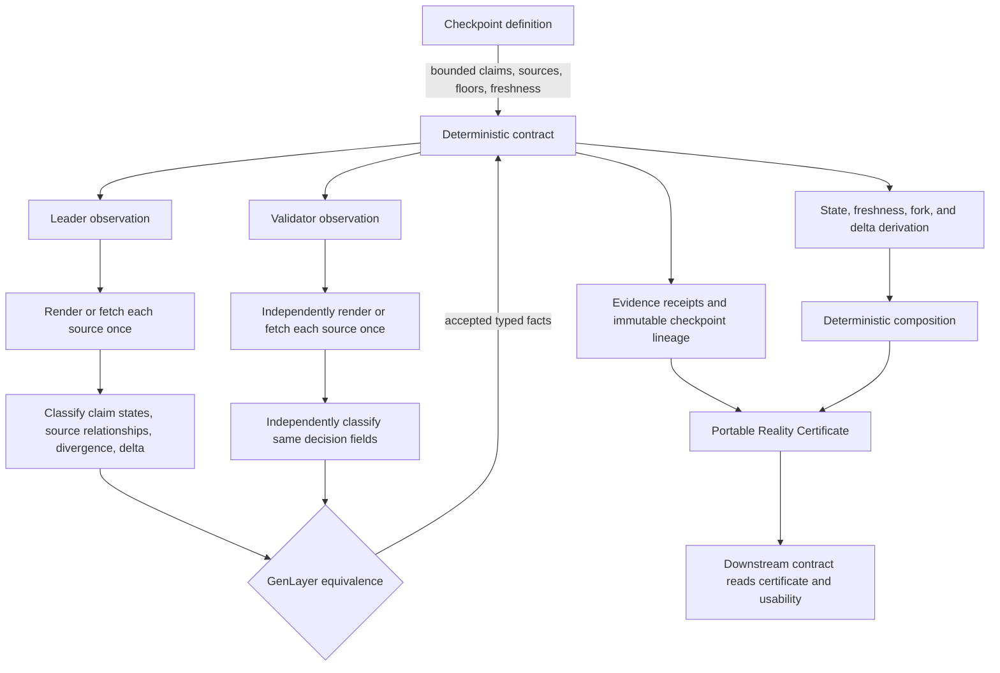

# Architecture

RCP fixes bounded inputs and policy in deterministic storage, then uses GenLayer's independently repeated observation path to resolve the parts that require external evidence and semantic judgment.

## Deterministic boundary

Contract code allocates identities and timestamps, validates graph bounds and enums, enforces claim retrieval permissions and independent-cluster floors, derives domain clusters from source URLs, derives terminal states and usability, fixes freshness windows, attributes claim-state deltas, composes child states, and appends successor receipts. It never asks the model to set protocol identity, cluster IDs, or thresholds.

## Non-deterministic boundary

The leader and validators each fetch each source once per observation, treat retrieved text as hostile evidence, classify source-level states and source relationships, identify divergence, and compare current facts with the prior receipt during revalidation. They agree on typed decision fields, not prose, model-invented cluster labels, or exact dynamic HTML bytes.

## Data lineage

`checkpoint_fingerprint` commits to definition, claim graph, source set, accepted state, evidence root, consensus digest, and version. Every evidence receipt has a deterministic ID bound to its checkpoint, claims, source, URL, retrieval kind, render/content hashes, normalization version, and retrieval status. Challenges and revalidation append immutable successor checkpoints; inconclusive attempts append separate receipts while preserving the last finalized checkpoint.

## Composition

Composition reads finalized children and applies a frozen critical-child/degradation/freshness/divergence policy. It stores child references and a deterministic digest. It does not mutate child checkpoint payloads. Depth is derived from child composition depth and is bounded at eight.
